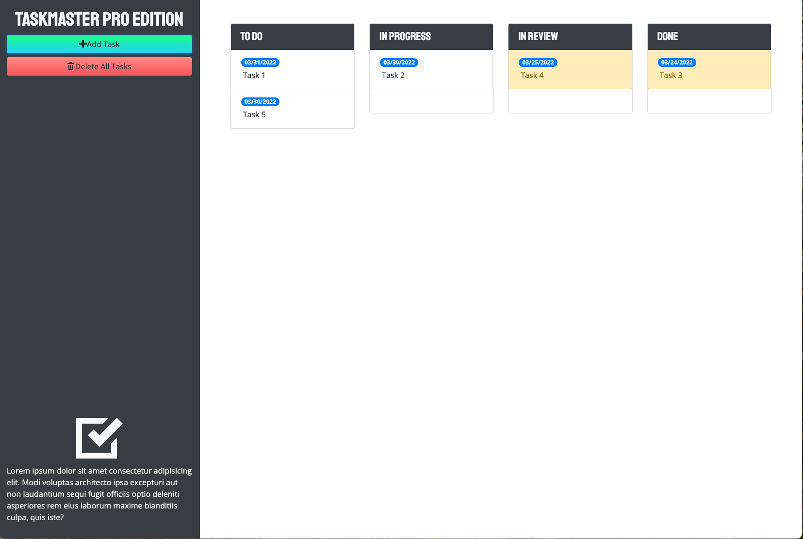

# Taskmaster Pro

## Description

This is a project to add significant improvements to the Taskmaster task management applicaton to include:

- Task editing - Task description and Due Date
- New columns for each task status - To Do, In Progress, In Review, and Done
- Drag/drop capabilities for moving tasks - including a drag/drop to delete
- Due date handling and auditing - including data pickers and near/overdue warnings 
- Improved appearance and customer experience

## Installation

There is no installation per se.  Just load the application from the link below.  The tasks are stored in the localStorage on the browser in the tasks file.  

## Usage

Load application at https://melliott7264.github.io/taskmaster-pro/

 

## Credits

Mark Elliott  https://github.com/melliott7264

Link to development files https://github.com/melliott7264/taskmaster-pro

Developed as part of the Module 5 excercise for the February 2022 UofR Coding Boot Camp https://courses.bootcampspot.com/courses/1201/pages/5-introduction-to-module-5?module_item_id=461081

## License

Copyright (c) 2022 Mark Elliott

Permission is hereby granted, free of charge, to any person obtaining a copy
of this software and associated documentation files (the "Software"), to deal
in the Software without restriction, including without limitation the rights
to use, copy, modify, merge, publish, distribute, sublicense, and/or sell
copies of the Software, and to permit persons to whom the Software is
furnished to do so, subject to the following conditions:

The above copyright notice and this permission notice shall be included in all
copies or substantial portions of the Software.

THE SOFTWARE IS PROVIDED "AS IS", WITHOUT WARRANTY OF ANY KIND, EXPRESS OR
IMPLIED, INCLUDING BUT NOT LIMITED TO THE WARRANTIES OF MERCHANTABILITY,
FITNESS FOR A PARTICULAR PURPOSE AND NONINFRINGEMENT. IN NO EVENT SHALL THE
AUTHORS OR COPYRIGHT HOLDERS BE LIABLE FOR ANY CLAIM, DAMAGES OR OTHER
LIABILITY, WHETHER IN AN ACTION OF CONTRACT, TORT OR OTHERWISE, ARISING FROM,
OUT OF OR IN CONNECTION WITH THE SOFTWARE OR THE USE OR OTHER DEALINGS IN THE
SOFTWARE.

---

